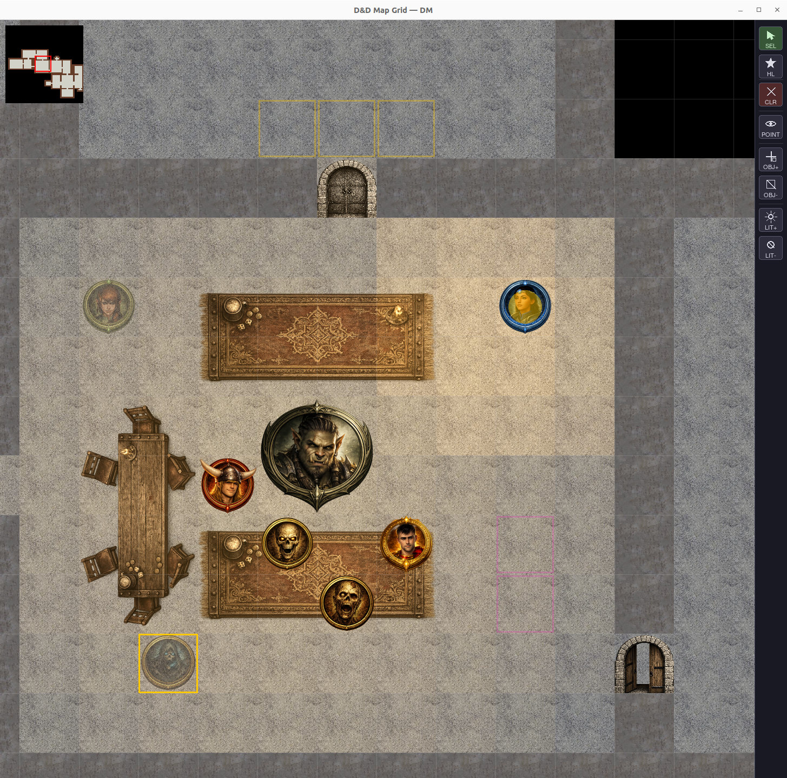

# DungeonPy

A Dungeon Master toolkit for virtual tabletop D&D sessions. DungeonPy runs two synchronized interfaces — a **combat tracker** and an **interactive 2D map** — and supports a **multiplayer mode** where the DM hosts a server and players connect as clients, each seeing only what their character would see.

> **No Python required.** Download the pre-built binary for your platform from the [Releases](../../releases) page and run it directly.

---

## Screenshots

| Combat Tracker | DM 2D Map | Player 2D Map |
|:-:|:-:|:-:|
|  |  |  |

---

## Features

### Combat Tracker
- Initiative-ordered combatant table with HP, turn tracking, and round counter
- Standard D&D conditions displayed as icons (Blinded, Charmed, Frightened, Invisible, Hidden, etc.)
- Add, remove, and edit combatants mid-session
- Load and save sessions as JSON files
- Chat system: the DM has one tab the player, per-tab read notifications

### 2D Map
- Tile-based grid renderer (floor, wall, void, door, secret door)
- Token placement, drag-and-drop movement, and zoom (20–120 px per tile)
- Right-click pan, minimap, and per-tile fog of war
- Map objects: place furniture and decorations with configurable width × height in tiles
- Lighting system: place light sources with configurable radius, color (warm, cool, white, red, green, blue, black), and intensity; light is blocked by walls and travels in straight lines (LOS-aware)

### Visibility System
- **Fog of war**: players only see tiles within their token's line of sight
- **Invisible** condition: the token is hidden from players unless they have the *See Invisible* condition
- **Hidden** condition: the token is invisible to all players, regardless of conditions

### Multiplayer
- DM hosts a WebSocket server; players connect as clients over a local network or the internet
- Players receive a live-updated map view restricted to their character's LOS
- A connection dialog lets players enter their name and the DM's address without touching the command line
- Chat system: the DM has one tab per player; per-tab unread notifications

### Session Persistence
- Full save/load of combatants, map state, light sources, and placed objects
- Autosave on session events

### Map Creator
- Standalone tile-based map editor — draw rooms, walls, doors, and terrain by hand
- Freehand paint mode and rectangle-fill mode for fast room layout
- Zoom (8–120 px per tile), pan, undo/redo (Ctrl+Z / Ctrl+Y)
- Saves directly to the `.txt` format read by DungeonPy
- Load and edit existing maps

---

## Installation

### Pre-built Binary (recommended)

Download the zip for your platform from the [Releases](../../releases) page. No Python required.

**Linux**
```bash
unzip dungeonpy-linux.zip
cd dungeonpy
./dungeonpy
```

**Windows**

Extract `dungeonpy-windows.zip` and double-click `dungeonpy.exe`.

### From Source

Requires Python 3.11+ on Linux or Windows.

```bash
git clone https://github.com/contefran/DungeonPy.git
cd DungeonPy
pip install -r requirements.txt
```

Dependencies:

| Package | Role |
|---------|------|
| `pygame` | Map renderer |
| `PySimpleGUI` | Tracker and chat UI |
| `Pillow` | Image loading and scaling |
| `websockets` | Multiplayer networking |
| `cryptography` | TLS certificate generation |

---

---

## Usage

### Starting the application

**Binary**
```bash
./dungeonpy          # Linux
dungeonpy.exe        # Windows (or double-click)
```

**From source**
```bash
python3 run_dnd_py.py
```

Launch DungeonPy and a startup dialog appears. Select your role:

- **Dungeon Master** — opens the tracker, map editor, and hosts a server that players can connect to.
  - **Start a new game** — loads the built-in example session so you can start placing combatants immediately.
  - **Load a previous game** — click **Browse** to pick a save file from `Savegames/` (or anywhere else).
  - Enter an optional session password (leave blank to allow anyone to join).
- **Player** — enter your character name and the DM's address, then connect.

### Advanced: command-line flags

Users can skip the launcher by passing flags directly:

```bash
python3 run_dnd_py.py --mode dm
python3 run_dnd_py.py --mode player --name "Aeriael" --host 192.168.1.10
```

**DM flags**

| Flag | Description |
|------|-------------|
| `--port` | WebSocket port (default: `8765`) |
| `--password` | Session password (prompted if omitted) |
| `--cert` / `--key` | Paths to a custom TLS certificate and key |

**Player flags**

| Flag | Description |
|------|-------------|
| `--name` | Your character name |
| `--host` | DM's IP address or hostname |
| `--port` | WebSocket port (default: `8765`) |
| `--color` | Token highlight color (`red`, `blue`, `green`, `purple`, `cyan`, `pink`, `white`) |
| `--insecure` | Skip TLS certificate verification (for self-signed certs) |

---

## Map Creator

`generate_map.py` is a standalone tool for drawing maps that DungeonPy can load. Run it separately from the main application — no server or session needed.

```bash
python3 generate_map.py                  # start with a blank map (size dialog appears)
python3 generate_map.py Maps/dungeon.txt # open and edit an existing map
```

| Action | How |
|--------|-----|
| Paint a tile | Left-click or drag (Free mode) |
| Fill a rectangle | Switch to **Rect** mode, then click and drag |
| Select tile type | Click a tile button in the left toolbar |
| Pan | Right-click drag |
| Zoom | Scroll wheel |
| Undo / Redo | Ctrl+Z / Ctrl+Y (or Ctrl+Shift+Z) |
| Save | Ctrl+S — saves to the current file |
| Save as new file | Ctrl+Shift+S or **Save As** button |
| Open existing map | Ctrl+O or **Open** button |
| New map | Ctrl+N or **New** button |

Maps are saved as `.txt` files in `Maps/` and can be loaded directly into a DungeonPy session via **Load Map** in the tracker.

---

## DM Setup — Hosting a Session

Follow these steps the first time you host a multiplayer session.

### 1. Start the server

Launch DungeonPy, select **Dungeon Master**, choose **Start a new game** or **Load a previous game**, enter an optional password, and click **Launch**. The tracker and map windows open and the server starts listening for players immediately.

### 2. TLS certificate (first run only)

On the very first launch, DungeonPy automatically generates a self-signed TLS certificate (`dm_cert.pem`) and private key (`dm_key.pem`) in the working directory. You will see:

```
[DungeonPy] Generating self-signed TLS certificate ...
[DungeonPy] Certificate saved to dm_cert.pem / dm_key.pem
```

This only happens once. The same files are reused for all future sessions. Keep them private and do not commit them to version control.

### 3. Find your IP address

> **Testing on the same machine?** Use `127.0.0.1` as the DM address. Run DungeonPy twice — once as DM, once as Player — in two separate terminals or by double-clicking the binary twice.

**LAN session** (everyone on the same network):
```bash
hostname -I        # shows your local IP, e.g. 192.168.1.42
```

**Internet session** (players connecting remotely):
```bash
curl ifconfig.me   # shows your public IP
```

DungeonPy also supports IPv6 addresses:
```bash
ip -6 addr show | grep "scope global"
```
Select the the non-temporary option and wrap it in square brackets when sharing, e.g. `[2a02:xxxx:...]:8765`.

### 4. Forward the port (internet sessions only)

On your router, create a port forwarding rule. It really depends on the specific router, but as a general rule it should be something like:

| Setting | Value |
|---------|-------|
| Protocol | TCP |
| External port | 8765 |
| Internal IP | your machine's LAN IP (the one from `hostname -I`)|
| Internal port | 8765 |

LAN sessions do not require port forwarding.

### 5. Share the address with players

Tell your players to connect to:
```
<your-ip>:<your-port> (e.g. 192.168.1.1:8765)
```

They enter this in the **DM address** field of the Player connection dialog. For LAN sessions the local IP is enough; for internet sessions use the public IP (or IPv6 wrapped in square brackets).

### 6. Load a map and start the session

1. In the tracker, click **Load Map** and select a `.txt` map file from `Maps/`
2. The map window opens — click empty tiles to place tokens for each combatant
3. Once tokens are placed, click **Show Map** to reveal the map to all connected players
4. Players will see only the tiles their token can see (fog of war)

---

## How to Use DungeonPy

### Combat Tracker (DM)

| Action | How |
|--------|-----|
| Add a combatant | Fill in Name, Initiative, HP → **Add New** |
| Edit a combatant | Click the row → modify fields → **Apply Stats** |
| Delete a combatant | Select the row → **Delete Selected** |
| Wound / Heal | Select row → enter value → **Wound** or **Heal** |
| Apply a condition | Select row → tick the condition checkbox → optionally set a duration in rounds → **Apply Stats** |
| Advance the turn | **Next Char** — moves the active marker down the initiative order |
| Go back | **Prev Char** |
| Save the session | **Export** — writes a JSON file to `Data/` |
| Load a session | **Load** — restores combatants, turn, and map state |
| Open chat | **Open Chat** — one tab per connected player; unread messages are flagged |
| Allow a player to move | Player panel → toggle the **Move** lock |
| Allow a player to select tokens | Player panel → toggle the **Select** lock |

Conditions with a duration (e.g. Invisible for 2 rounds) expire automatically at the correct initiative tick — no manual tracking needed.

---

### Map — DM

| Action | How |
|--------|-----|
| Load a map | Toolbar → **Load Map** |
| Place a token | Select tool active → click an empty floor tile (places the next unplaced combatant) |
| Move a token | Drag it to a new tile |
| Select a token | Click it — syncs selection with the tracker |
| Toggle a door | Click a door tile |
| Zoom | Scroll wheel |
| Pan | Right-click drag |
| Add a light source | Toolbar → **Add Light** → click a tile → set radius, color, and intensity |
| Remove a light source | Toolbar → **Remove Light** → click the light tile |
| Place an object | Toolbar → **Add Object** → pick an image → click a tile |
| Remove an object | Toolbar → **Remove Object** → click the object |
| Show/hide map to players | Toolbar → **Show Map** / **Hide Map** |
| Recenter all players | Toolbar → **Recenter** |

---

### Map — Player

When you launch DungeonPy and select **Player**, a dialog asks for your character name and the DM's address. Once connected:

| Action | How |
|--------|-----|
| Move your token | Drag it (only when the DM has enabled movement) |
| Highlight a tile | Click a floor tile (only when the DM has enabled selection) |
| Toggle chat | Toolbar button in the map window |
| Quit | **Quit** button in the chat window, or close the map |

You see only the tiles your character can currently see. Tiles you have visited before remain visible but dimmed. Creatures with the **Invisible** condition are hidden unless your character has **See Invisible**; creatures with the **Hidden** condition are never visible on your map.

---

## Security

DungeonPy uses **TLS-encrypted WebSocket connections** (`wss://`) between the DM server and player clients. All traffic — map state, token positions, chat — is encrypted in transit.

### Transport encryption (TLS)

All connections use TLS. There are two ways to handle the certificate:

**Self-signed certificate (default)**
On first launch, DungeonPy auto-generates a self-signed RSA-2048 / SHA-256 certificate valid for 10 years, saved as `dm_cert.pem` and `dm_key.pem`. No setup required. Because the certificate is not issued by a trusted CA, players must skip verification by ticking *Skip TLS verification* in the connection dialog (or passing `--insecure`). This is already the default in `player_connect.sh`. One would assume that a software meant to be used for a d&d session among friends wouldn't pose a security risk, but since this is a cruel world:

**Custom certificate (recommended for internet sessions)**
If you own a domain and have a certificate from a trusted CA (e.g. Let's Encrypt), pass it to the DM server:
```bash
python3 run_dnd_py.py --mode dm --cert /path/to/cert.pem --key /path/to/key.pem
```
Players connecting to a trusted certificate do not need `--insecure`.

> **Keep `dm_key.pem` private.** It is listed in `.gitignore` and must never be committed or shared. If it is compromised, delete both `.pem` files and restart the server to regenerate them.

### Password protection

The DM is prompted for a session password on every startup. If set:
- Players must enter the correct password in the connection dialog to join.
- A wrong password is rejected at the handshake level — the connection is closed before any game state is transmitted.

Leaving the password blank disables authentication entirely, which is suitable for a closed group on a trusted LAN but not recommended for internet sessions.

### Permission model

Even after connecting, players have limited capabilities by default:

| Action | Default | DM can change |
|--------|---------|---------------|
| Move own token | Locked | ✓ per-player toggle |
| Select / highlight tokens | Locked | ✓ per-player toggle |
| Advance turn, edit combatants, load maps | Never | — (DM only) |

Players cannot spoof another player's identity, claim DM privileges, or connect twice under the same name.

### Summary

| Scenario | Recommended settings |
|----------|----------------------|
| LAN session, trusted group | DM: blank password · Player: `--insecure` |
| LAN session, untrusted group | DM: set password · Player: `--insecure` |
| Internet session, self-signed cert | DM: set password · Player: `--insecure` |
| Internet session, trusted CA cert | DM: `--cert`/`--key` + password · Player: no flags |

---

## Map Format

Maps are plain-text `.txt` files in `Maps/`. Each character represents one tile:

| Code | Tile |
|------|------|
| `0` | Floor |
| `1` | Wall |
| `2` | Void (impassable, no rendering) |
| `3` | Door |
| `4` | Secret door |
| `g` | Grass |

---

## Save File Format

Session files are JSON and live in `Data/` (examples) or `Savegames/` (runtime saves):

```json
{
  "initiative": [
    { "name": "Aeriael", "initiative": 18, "hp": 30, "conditions": [], "pos": [3, 5], "icon": "aeriael.png", "is_pc": true }
  ],
  "active_index": 0,
  "turn": 1,
  "map": "dungeon.txt",
  "light_sources": [
    { "pos": [4, 4], "radius": 5, "color": "warm", "alpha": 80 }
  ]
}
```

---

## Command-line Reference

```
python3 run_dnd_py.py [--mode MODE] [--dir PATH] [--verbose] [--super_verbose]
                      [--host HOST] [--port PORT]
                      [--name NAME] [--color COLOR]
                      [--password PASSWORD]
                      [--insecure] [--cert FILE] [--key FILE]
```

| Flag | Default | Description |
|------|---------|-------------|
| `--mode` | `both` | `both` / `map` / `tracker` / `dm` / `player` |
| `--dir` | `./` | Base directory for assets, maps, and data |
| `--verbose` | off | Timestamped event logging |
| `--super_verbose` | off | Per-combatant comparison logs |

---

## Future Work

- **Meshnet play** — out-of-the-box support for overlay networks (e.g. Tailscale, ZeroTier) so players can connect without port forwarding
- **Dice roller** — integrated dice rolling with results broadcast to all players

---

## License

MIT License — see [LICENSE](LICENSE).
