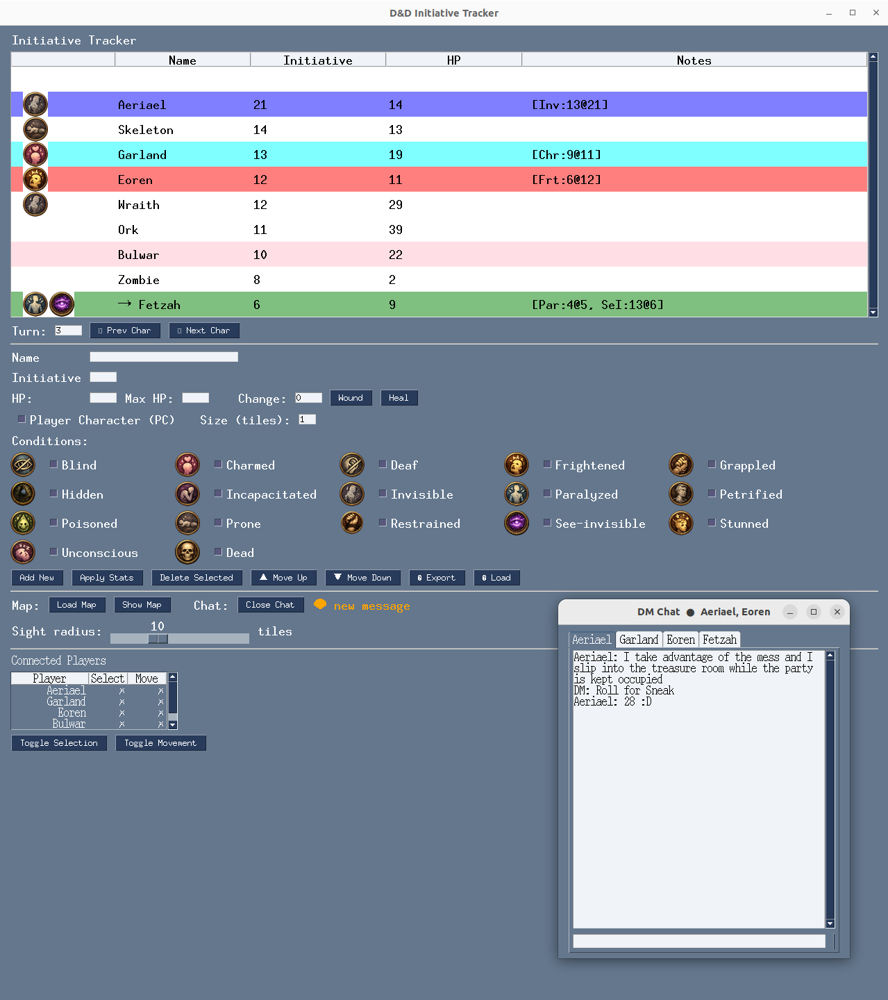
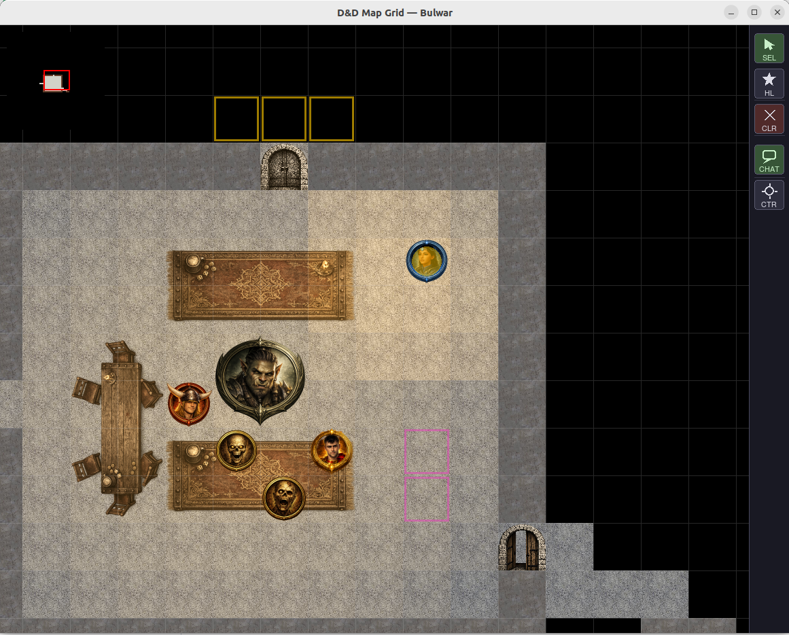

# DungeonPy 1.1.4

A Dungeon Master toolkit for virtual tabletop D&D sessions. DungeonPy runs two synchronized interfaces — a **combat tracker** and an **interactive 2D map** — and supports a **multiplayer mode** where the DM hosts a server and players connect as clients, each seeing only what their character would see.

---

## Screenshots

| Combat Tracker | 2D Map | Player View |
|:-:|:-:|:-:|
|  |  |  |

---

## Features

### Combat Tracker
- Initiative-ordered combatant table with HP, turn tracking, and round counter
- 16 standard D&D conditions displayed as emoji (Blinded, Charmed, Frightened, Invisible, Hidden, etc.)
- Add, remove, and edit combatants mid-session
- Load and save sessions as JSON files

### 2D Map
- Tile-based grid renderer (floor, wall, void, door, secret door, grass)
- Token placement, drag-and-drop movement, and zoom (20–120 px per tile)
- Right-click pan, minimap, and per-tile fog of war
- Map objects: place furniture and decorations with configurable width × height in tiles
- Lighting system: place light sources with configurable radius, color (warm, cool, white, red, green, blue, black), and intensity; light is blocked by walls and travels in straight lines (LOS-aware)

### Visibility System
- **Fog of war**: players only see tiles within their token's line of sight
- **Invisible** condition: the token is hidden from players unless they have the *See Invisible* condition
- **Hidden** condition: the token is invisible to all players, regardless of conditions

### Multiplayer
- DM hosts a WebSocket server; players connect as clients over a local network or the internet
- Players receive a live-updated map view restricted to their character's LOS
- A connection dialog lets players enter their name and the DM's address without touching the command line
- Chat system: the DM has one tab per player; per-tab unread notifications

### Session Persistence
- Full save/load of combatants, map state, light sources, and placed objects
- Autosave on session events

---

## Requirements

- Python 3.11+
- Linux (Windows support planned — see [Future work](#future-work))

---

## Installation — From Source

```bash
git clone https://github.com/contefran/DungeonPy.git
cd DungeonPy
pip install -r requirements.txt
```

Dependencies installed:

| Package | Role |
|---------|------|
| `pygame` | Map renderer |
| `PySimpleGUI` | Tracker and chat UI |
| `Pillow` | Image loading and scaling |
| `websockets` | Multiplayer networking |
| `cryptography` | TLS certificate generation |

---

## Installation — Binary (Linux)

Pre-built binaries are available on the [Releases](../../releases) page. Download and extract the `.zip`, then make the scripts executable:

```bash
unzip dungeonpy-linux.zip
cd dungeonpy
chmod +x dm_server.sh player_connect.sh
```

No Python installation required for players using the binary.

---

## Usage

### Local play (no networking)

```bash
python3 run_dnd_py.py                  # tracker + map
python3 run_dnd_py.py --mode tracker   # tracker only
python3 run_dnd_py.py --mode map       # map only
```

### Multiplayer — DM

```bash
# From source
python3 run_dnd_py.py --mode dm

# Binary
./dm_server.sh
```

You will be prompted for a session password (leave blank to disable). The DM interface includes the full tracker, the map editor, and the chat window.

Optional flags:

| Flag | Description |
|------|-------------|
| `--host` | Bind address (default: `0.0.0.0`, all interfaces) |
| `--port` | WebSocket port (default: `8765`) |
| `--password` | Session password (prompted if omitted) |
| `--cert` / `--key` | Paths to a custom TLS certificate and key |

### Multiplayer — Player

```bash
# From source
python3 run_dnd_py.py --mode player

# Binary
./player_connect.sh
```

A connection dialog will appear asking for your name and the DM's address. You can also pass them directly:

```bash
python3 run_dnd_py.py --mode player --name "Aria" --host 192.168.1.10
```

Optional flags:

| Flag | Description |
|------|-------------|
| `--name` | Your character name |
| `--host` | DM's IP address or hostname |
| `--port` | WebSocket port (default: `8765`) |
| `--color` | Token highlight color (`red`, `blue`, `green`, `purple`, `cyan`, `pink`, `white`) |
| `--insecure` | Skip TLS certificate verification (see Security below) |

---

## Security

DungeonPy uses **TLS-encrypted WebSocket connections** (`wss://`) between the DM server and player clients.

### Certificate handling

- On first launch in DM mode, a self-signed TLS certificate and private key are **auto-generated** and saved as `dm_cert.pem` / `dm_key.pem`.
- Players connecting over a LAN to a self-signed certificate should pass `--insecure` (or tick the checkbox in the connection dialog) to skip certificate verification. This is the default behaviour of `player_connect.sh`.
- For sessions over the internet, it is recommended to supply a **proper certificate** from a trusted CA via `--cert` and `--key`. In that case players do not need `--insecure`.

### Password protection

- The DM is prompted for a session password on startup. If set, players must supply the correct password to join.
- Leaving the password blank disables authentication (suitable for trusted LAN sessions).

### Summary

| Scenario | Recommended settings |
|----------|----------------------|
| LAN session, self-signed cert | DM: default · Player: `--insecure` |
| Internet session, proper cert | DM: `--cert`/`--key` · Player: no flags |
| Trusted LAN, no auth needed | DM: blank password · Player: `--insecure` |

---

## Map Format

Maps are plain-text `.txt` files in `Maps/`. Each character represents one tile:

| Code | Tile |
|------|------|
| `0` | Floor |
| `1` | Wall |
| `2` | Void (impassable, no rendering) |
| `3` | Door |
| `4` | Secret door |
| `g` | Grass |

---

## Save File Format

Session files are JSON and live in `Data/` (examples) or `Savegames/` (runtime saves):

```json
{
  "initiative": [
    { "name": "Aria", "initiative": 18, "hp": 30, "conditions": [], "pos": [3, 5], "icon": "aria.png", "is_pc": true }
  ],
  "active_index": 0,
  "turn": 1,
  "map": "dungeon.txt",
  "light_sources": [
    { "pos": [4, 4], "radius": 5, "color": "warm", "alpha": 80 }
  ]
}
```

---

## Command-line Reference

```
python3 run_dnd_py.py [--mode MODE] [--dir PATH] [--verbose] [--super_verbose]
                      [--host HOST] [--port PORT]
                      [--name NAME] [--color COLOR]
                      [--password PASSWORD]
                      [--insecure] [--cert FILE] [--key FILE]
```

| Flag | Default | Description |
|------|---------|-------------|
| `--mode` | `both` | `both` / `map` / `tracker` / `dm` / `player` |
| `--dir` | `./` | Base directory for assets, maps, and data |
| `--verbose` | off | Timestamped event logging |
| `--super_verbose` | off | Per-combatant comparison logs |

---

## Future Work

- **Windows support** — PyInstaller builds for Windows; CI pipeline with GitHub Actions for cross-platform releases
- **Meshnet play** — out-of-the-box support for overlay networks (e.g. Tailscale, ZeroTier) so players can connect without port forwarding
- **Condition images** — replace emoji conditions with custom PNG icons per condition
- **Dice roller** — integrated dice rolling with results broadcast to all players

---

## License

MIT License — see [LICENSE](LICENSE).
